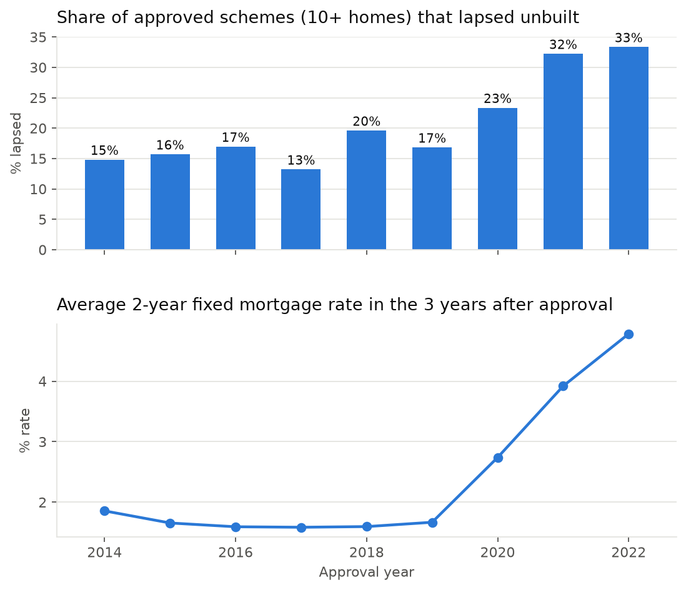

# Why don't approved London homes get built?

**House London #2 Data Hackathon, 26 September 2026**

We followed **4,253 London housing schemes of 10+ homes approved 2014 to 2022** (589,000 homes)
and asked which ones **lapsed**: the 3 year planning permission expired with no construction start.
House London #0 measured *how many* permitted homes go unbuilt, and left *why* as its biggest open
question. This repo is our answer.

> **Short answer: the cost of credit, mainly for financing construction rather than for buyers.**
> The lapse rate nearly doubled for schemes approved in 2020 to 2022. Higher mortgage rates explain
> about three quarters of that rise. Build costs explain about a third. Weak buyer demand explains
> almost none.



## Headline findings

| | Finding | Key number (90% interval) |
|---|---|---|
| 1 | **The lapse rate nearly doubled** | 16% of schemes approved 2014 to 2019, 29% of those approved 2020 to 2022 |
| 2 | **The cost of credit explains most of the rise** | Holding mortgage rates at their 2014 to 2019 level removes **76%** of it (62 to 88%) |
| 3 | **Build costs matter, but less** | Holding cost inflation at its 2014 to 2019 level removes **31%** (15 to 48%) |
| 4 | **Buyer demand explains little** | Holding local home sales at normal levels removes **5%** (-3 to 15%) |
| 5 | **The channel looks like financing, not buyers** | +1pp on the mortgage rate adds **4.4 to 5.4pp** of lapse risk for *every* tenure mix. If buyers were the problem, for-sale schemes would be hit hardest. They are not. |
| 6 | **Today's pipeline is at risk** | Of 111,000 homes approved since 2023 and not yet started, **~30,600 are expected to lapse** (22,800 to 37,900), versus ~10,700 under 2015 to 2019 conditions |

The shares in rows 2 to 4 overlap and sum to more than 100% because the model is non-linear.

Full method, results, robustness checks and limitations: **[REPORT.md](REPORT.md)**.

## The simulator

**[Open the simulator](https://qerberos-code.github.io/house-london-2/outputs/simulator.html)**
(source: [`outputs/simulator.html`](outputs/simulator.html)). It runs the fitted model in the browser.
You can also download the file and open it locally; it works offline.

- **Set the market:** mortgage rate over the next 3 years, build-cost rise, local home sales versus normal.
- **Set the scheme:** number of homes, share for sale, borough, tall building or not.
- **See:** the scheme's chance of starting (with a 90% range), how much each market factor moves it
  compared with 2015 to 2019, and expected homes lapsing across the live pipeline.

The rate effect is learned from a single episode (the 2020 to 2022 rise), so the simulator warns
above a 5% mortgage rate.

## How we did it

1. **Built a scheme panel** from the GLA Planning London Datahub: one row per approved 10+ home
   scheme, with its outcome (Completed, Commenced or Lapsed), tenure mix, size, height and borough.
2. **Attached market conditions** over each scheme's 36 month window after approval: Bank of England
   mortgage rates, the ONS housing build-cost index, and HM Land Registry house prices and sales by borough.
3. **Modelled the chance of lapsing** with a logistic regression, including interaction terms that
   tell demand and financing apart (for example, do high rates hurt for-sale schemes more?).
   Standard errors are clustered by borough, and every interval comes from a 200 draw cluster bootstrap.
4. **Checked robustness:** alternative rate series (95% LTV mortgage, SONIA), different treatments of
   superseded permissions and token starts, and complete cases only. The rate effect is significant
   in every variant.

### Data pitfalls we handled

- `lapsed_date` is filled for nearly every row. It is the **expiry** date, not an event, so the outcome
  is `status == "Lapsed"`.
- **Superseded** permissions (usually replaced by a Section 73 variation) are neither failures nor starts.
  They are dropped from the main model and bounded both ways in the robustness checks.
- Schemes approved **2023 or later** have not reached their 3 year deadline, so they are excluded from
  the model instead of being counted as "not lapsed".
- **Token starts** (commencement in the last days before the deadline) are tested by counting them as lapses.
- Borough names differ between sources ("Barking & Dagenham" vs "Barking and Dagenham"), so every join
  uses ONS borough codes (E09...).

## Repo map

| File | What it does |
|---|---|
| [`REPORT.md`](REPORT.md) | Full write-up: findings, data, model, results, robustness, validation, limitations |
| [`PLAN.md`](PLAN.md) | Working plan: data checks, variable choices, team split, early results |
| `pld_download.py` | Downloads approved 10+ unit schemes from the Planning London Datahub, writing `data/pld_schemes.parquet` |
| `boe_download.py` | Downloads Bank of England mortgage and SONIA rates, writing `data/mortgage_rates_monthly.csv` |
| `pipeline.py` | Builds the scheme panel with market variables attached, writing `data/scheme_panel.parquet` |
| `analysis.py` | Charts, logistic model, bootstrap, marginal effects and decomposition, writing to `outputs/` |
| `robustness.py` | Re-estimates the key effects under seven data choices, writing `outputs/robustness.csv` |
| `build_simulator.py` | Inlines the model and live pipeline into `simulator_template.html`, writing `outputs/simulator.html` |
| `exploratory.py` | Exploration of House London's Foundations dataset (PlanIt applications), used for validation only |
| `schemes_with_market.csv` | A teammate's merged scheme and market table. Not produced by the scripts above |
| `outputs/` | Charts, model results, marginal effects, decomposition, robustness table and the simulator |
| `outputs/London Housing Delivery vs Financing Conditions.html` | ["Where London Housing Delivery Stalls"](https://qerberos-code.github.io/house-london-2/outputs/London%20Housing%20Delivery%20vs%20Financing%20Conditions.html): a standalone presentation page following 26,961 permissions decided 2018 to 2023 |

## Reproduce

```bash
python3 -m venv .venv
.venv/bin/pip install pandas pyarrow requests statsmodels scikit-learn matplotlib openpyxl
mkdir -p data

.venv/bin/python pld_download.py
.venv/bin/python boe_download.py
curl -L -o data/uk_hpi_full.csv https://publicdata.landregistry.gov.uk/market-trend-data/house-price-index-data/UK-HPI-full-file-2026-06.csv
curl -L -A "Mozilla/5.0" -o data/ons_opi.xlsx "https://www.ons.gov.uk/file?uri=/businessindustryandtrade/constructionindustry/datasets/interimconstructionoutputpriceindices/current/bulletindataset9.xlsx"

.venv/bin/python pipeline.py
.venv/bin/python analysis.py
.venv/bin/python robustness.py
.venv/bin/python build_simulator.py
```

`data/` is git ignored; every file in it can be re-downloaded with the commands above.

## Data sources

| Source | Used for |
|---|---|
| [Planning London Datahub](https://planningdata.london.gov.uk) (GLA) | Scheme outcomes, dates, tenure, size, height, borough |
| [Bank of England IADB](https://www.bankofengland.co.uk/boeapps/database/) | 2 year fixed mortgage rates (`IUMBV34`, `IUMB482`) and SONIA (`IUDSOIA`) |
| [ONS Construction Output Price Indices](https://www.ons.gov.uk/businessindustryandtrade/constructionindustry) | New housing build-cost index |
| [UK House Price Index](https://www.gov.uk/government/collections/uk-house-price-index-reports) (HM Land Registry) | Borough house prices and sales volumes |
| [House London Foundations](https://foreman.house-london.uk) | PlanIt planning applications, for validation |

## Limitations

- The rate effect is identified by **one episode** (2020 to 2022), which also saw COVID, labour
  shortages and the Building Safety Act. The *level* effect is probably overstated. The demand vs
  financing test is also run within each approval year, where those shocks cancel out.
- **"Financing" is inferred, not measured.** Developer loan terms, land prices, viability appraisals
  and developer identity are not public.
- The model explains **average patterns, not individual sites** (cross-validated AUC 0.63, good calibration).
- Only schemes of **10+ homes** are covered.

See REPORT.md section 11 for the direction of each bias.

## Build on this

- Match applicants to the Regulator of Social Housing list to test the financing channel directly
  (housing associations vs private developers).
- Use new-build sales only (Price Paid Data flags them) for a sharper demand measure.
- Fit a survival model so the 2023+ cohorts can contribute before their deadline.
- Study build-out time (start to completion), not just starts.
- Link Section 73 variations that cut affordable housing, as a direct viability signal.

## Context

House London #0 ([problems](https://www.house-london.uk/hackathons/zero/problems/),
[solutions](https://www.house-london.uk/hackathons/zero/solutions/),
[conclusions](https://www.house-london.uk/hackathons/zero/conclusions/)) found that large numbers of
permitted London homes are never started, and named the reason as "genuinely open". This project
tests the leading explanations against each other with public data.

## Team

| Name | GitHub | Contributed |
|---|---|---|
| Angus | [@qerberos-code](https://github.com/qerberos-code) | Repo setup, README |
| Tommaso Fazzi | [@TommasoFazzi](https://github.com/TommasoFazzi) | Data pipeline, model, robustness checks, simulator, report |
| Mohammad Faisal | [@MFaisal077](https://github.com/MFaisal077) | "Where London Housing Delivery Stalls" presentation page |

Team members not listed here: add yourself in a pull request.
