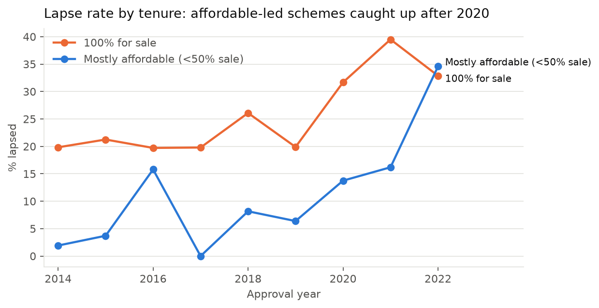
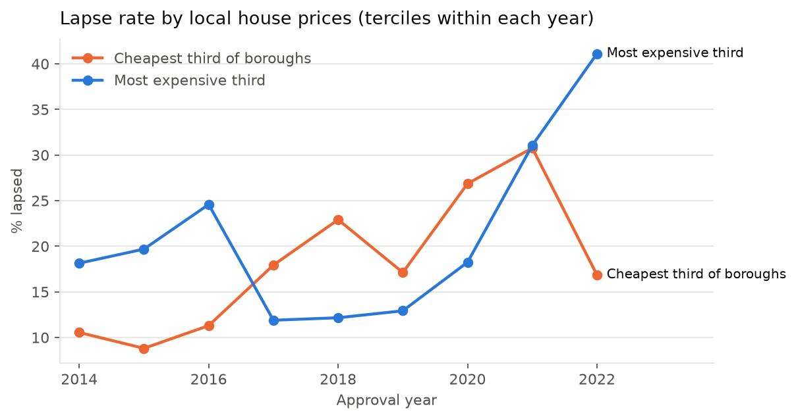
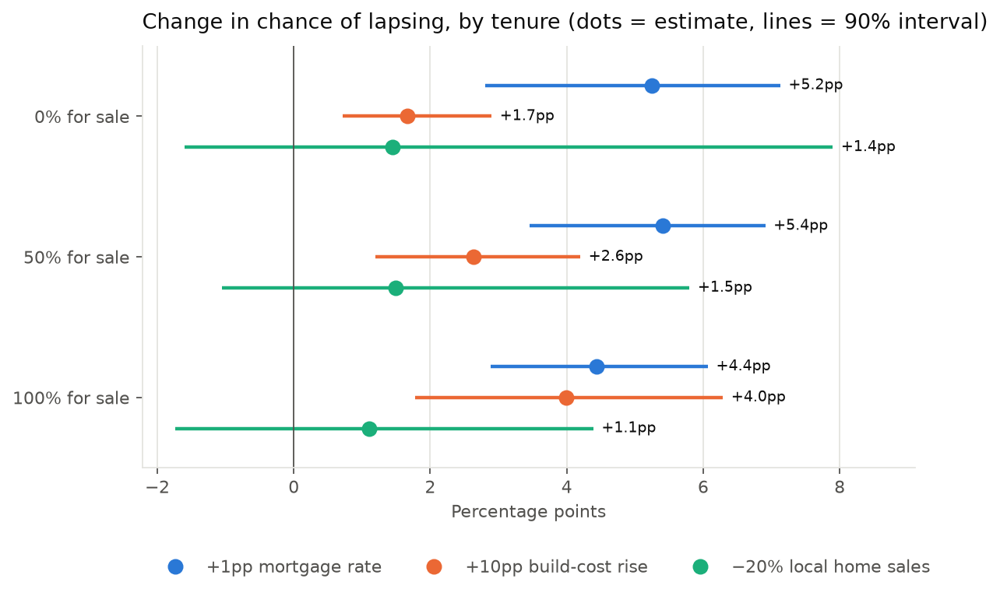

# Why approved London homes don't get built

**House London hackathon, 26 September 2026.** Every number here is reproducible with the scripts in this repo (see [Reproduce](#13-reproduce)).

## 1. Headline findings

We follow **4,253 London housing schemes of 10+ homes approved 2014–2022** (589,000 homes) and ask which ones **lapsed**: the 3-year permission expired with no construction start.

1. **The lapse rate doubled.** It was 16% for schemes approved 2014–19 and 29% for those approved 2020–22. By homes, 21% of all homes approved in the period sat in schemes that lapsed.
2. **The cost of credit explains most of the rise.** Holding mortgage rates at their 2014–19 level removes **~76%** of the modelled increase (90% interval 62–88%). Holding build-cost inflation at its 2014–19 level removes **~31%** (15–48%).
3. **Buyer demand explains little.** Measured directly as the number of homes sold in each borough, demand accounts for only **~5%** of the rise (−3% to 15%). A 20% fall in local sales adds just 1–1.5 percentage points of lapse risk, which is not statistically different from zero.
4. **The rate effect points to financing, not buyers.** If high rates stalled schemes by scaring off buyers, for-sale schemes would be hit hardest. They are not. A 1pp higher mortgage rate raises lapse risk by **4.4–5.4 percentage points for every tenure mix**. In relative terms it raises the odds by ~90% for affordable-led schemes and ~30% for 100% for-sale schemes. The likely channel is the cost of **financing construction** for developers and housing associations.
5. **Build costs matter, but less.** A 10pp faster rise in build costs over the 3 years adds 1.7–4.0pp of lapse risk. The extra "cost × cheap borough" (margin squeeze) effect has the expected sign but is not statistically significant.
6. **Today's pipeline.** 581 schemes (111,000 homes) approved since 2023 have not started. At today's rates and sales, the model expects **~30,600 homes to lapse** (90% range 22,800–37,900). Under 2015–19 conditions it would be ~10,700.


---

## 2. Data

| Source | What we use | Grain | Script |
|---|---|---|---|
| **Planning London Datahub (GLA)**, guest Elasticsearch API | Approved 10+ unit schemes: status (Completed / Commenced / Lapsed / Superseded), decision and commencement dates, units by tenure, storeys, borough | Scheme | `pld_download.py` |
| **Bank of England IADB** | `IUMBV34` quoted 2y fixed mortgage rate, 75% LTV (main). `IUMB482` 95% LTV and `IUDSOIA` SONIA (robustness) | Monthly | `boe_download.py` |
| **ONS Construction Output Price Indices** | New-work *housing* price index (2015=100) | Monthly, from Jan 2014 | `pipeline.py` |
| **UK HPI (HM Land Registry)** | Average house price and **number of sales** (`SalesVolume`) by borough | Borough × month | `pipeline.py` |

**Not available anywhere public** (so not in the model):

- land prices;
- the terms of developers' and housing associations' loans;
- scheme viability appraisals;
- developer identity;
- sales rates per scheme.

Everything we say about "financing" is inferred from patterns, not measured directly.

---

## 3. Building the panel

**Funnel**
```
22,520  approved schemes with 10+ proposed homes in the PLD (all years)
 5,138  approved Jan 2014 – Dec 2022
 4,259  with a resolved outcome: Completed, Commenced or Lapsed
 4,253  matched to borough house-price and sales series (6 LLDC schemes unmatched)
```

**Design choices and why**

- **Outcome = `status == "Lapsed"`.** The PLD field `lapsed_date` is filled for ~100% of rows. It is the *expiry* date, not the event, so it is not usable.
- **Why start in 2014 and stop in 2022.** The ONS cost index starts in January 2014. Schemes approved in 2023 or later have not reached their 3-year deadline yet, so treating them as "not lapsed" would bias the result.
- **"Superseded" schemes (16% of the window) are dropped** in the main model. They were replaced by a later permission (usually a Section 73 variation), so they are neither a failure nor a start. Section 8 shows both extreme treatments.
- **Market exposure is measured over a fixed 36-month window** after approval, the period in which the developer must decide. We deliberately don't use "conditions until the start date", because that window would depend on the outcome itself.
- **Borough names** are harmonised to the ONS codes (E09…). PLD writes "Barking & Dagenham" or "London Borough of Barnet"; the HPI writes "Barking and Dagenham".
- **Sales data lag.** Land Registry registrations arrive months late, so 2026 months are incomplete. The sales series is cut at December 2025, which is after every scheme's window ends.

## 4. Variables

| Variable | Definition | Side | Coverage |
|---|---|---|---|
| `lapsed` (outcome) | 1 if the permission lapsed unstarted | — | 100% |
| `rate` | Mean 2y-fixed mortgage rate over months 0–35 after approval | Credit cost (both sides, see §6) | 100% |
| `cost` | ONS housing output-price change from approval to month 36 | Supply | 100% |
| `sales` | log of homes sold in the borough over months 0–35, relative to that borough's 2014–19 monthly average (1 = normal) | **Demand** | 99.9% |
| `sale` | Market-for-sale units ÷ total units. Only computed when the tenure fields sum to ≥90% of units; otherwise set to the median (1.0) with a `sale_missing` flag | Exposure to buyers | 77% observed |
| `units` | log(number of proposed homes) | Control | 100% |
| `tall` | Tallest building ≥7 storeys, plus a `storeys_missing` flag | Regulation / cost | 50% observed |
| `hpi` | log borough average price in the approval month | Margin headroom | 99.9% |

Continuous variables are standardised (z-scores). One standard deviation is 0.99pp for the mortgage rate, 6.4pp for the cost rise and 12% for local sales.

**Why mortgage *approvals* are not used.** The national count of mortgage approvals correlates −0.75 with the rate over the same windows. It is itself a consequence of the rate, so including both would absorb part of the rate effect (a "bad control"). It also barely varied before 2020. Local sales volume is the better demand measure: it varies across boroughs as well as over time, so it can be estimated even when every approval year gets its own fixed effect.

---

## 5. What the raw data shows

**By tenure.** For-sale schemes always lapse more. After 2020, affordable-led schemes caught up: their lapse rate went from under 10% to 16–35%.



**By local prices** (terciles within each year). There is no stable "cheap boroughs lapse more" pattern. In 2022 the *expensive* boroughs lapsed most.



**Local sales** averaged 82–86% of normal over the 2021–22 cohorts' windows, with some boroughs below 65%. Their correlation with the mortgage rate is only −0.26, so the data has enough independent variation to test demand.

## 6. Model

A logistic regression of `lapsed` on the drivers plus three interactions that test the mechanisms:

```
lapsed ~ sale + units + tall + hpi + rate + cost + sales
         + rate×sale + cost×hpi + sales×sale        (+ missing flags)
```

- **Standard errors** are clustered by borough (33 clusters): schemes in the same borough share a planning regime and local market.
- **90% intervals** come from a **cluster bootstrap**: 200 resamples of whole boroughs, with the model refitted each time. Every interval in this report and in the simulator uses these draws.
- **Why logit.** The outcome is binary, and maximum likelihood is the efficient estimator when the model is well specified. We report effects in percentage points (averaged over the real schemes), not raw coefficients.

**Which coefficient answers which question**

| Question | Coefficient | What each sign means |
|---|---|---|
| Does the cost of credit matter? | `rate` | Positive means higher rates, more lapses. It **mixes** buyer demand and construction financing, because mortgage rates and developer borrowing rates move together |
| Does buyer demand matter? | `sales` | **Negative** means fewer local sales, more lapses, which is the demand channel |
| Does demand bite where it should? | `sales × sale` | **Negative** means weak sales hurt for-sale schemes more (demand) |
| Demand or financing behind the rate effect? | `rate × sale` | **Positive** means rates hurt for-sale schemes more (**demand**). **Zero or negative** means rates hurt all schemes alike (**financing**) |
| Do construction costs matter? | `cost` | Positive means supply-side cost pressure |
| Margin squeeze? | `cost × hpi` | Negative means costs hurt more where prices are low |

**Identification**

1. *Do rates matter?* This comes from **variation over time**: rates were flat for the 2014–19 cohorts and rose sharply for 2020–22. It is effectively one natural experiment, so this level effect also picks up anything else that moved with rates in 2020–22. That includes COVID, labour shortages and the Building Safety Act.
2. *Demand and mechanism* (`sales`, `rate × sale`) are also estimated **within each approval year**, using year fixed effects. Every scheme in a given cohort faced the same national market, so time-wide shocks cancel out. What remains is whether boroughs with weaker sales, or schemes with more market-sale homes, fared differently.

## 7. Results

| Term | Coefficient | 90% bootstrap interval | Reading |
|---|---|---|---|
| rate (z) | **+0.62** | 0.35 to 0.83 | Higher rates → more lapses |
| rate × sale | **−0.37** | −0.59 to −0.10 | Rates do *not* hurt for-sale schemes more; relatively, they hurt affordable-led schemes more |
| sale | **+1.44** | 1.06 to 1.82 | For-sale schemes lapse more at any rate |
| cost (z) | **+0.15** | 0.07 to 0.23 | Faster cost growth → more lapses |
| cost × hpi | −0.06 | −0.13 to 0.03 | Margin-squeeze sign, not significant |
| sales (z) | −0.10 | −0.45 to 0.14 | Demand sign, not significant |
| sales × sale | +0.07 | −0.18 to 0.45 | Opposite of the demand prediction, not significant |
| tall | +0.26 | −0.01 to 0.56 | Weak signal (Gateway 2?) |
| hpi, units | ~0 | include 0 | No effect |

With year fixed effects, rate × sale is −0.23 (SE 0.13) and sales is −0.14 (SE 0.16).

**Effects in percentage points** (the change in lapse probability, averaged over all 4,253 schemes):



| Scheme | +1pp mortgage rate | +10pp build-cost rise | −20% local home sales |
|---|---|---|---|
| 0% for sale | +5.2pp (2.8 to 7.1) | +1.7pp (0.7 to 2.9) | +1.4pp (−1.6 to 7.9) |
| 50% for sale | +5.4pp (3.5 to 6.9) | +2.6pp (1.2 to 4.2) | +1.5pp (−1.1 to 5.8) |
| 100% for sale | +4.4pp (2.9 to 6.1) | +4.0pp (1.8 to 6.3) | +1.1pp (−1.7 to 4.4) |

**How to read this correctly.**

- **Rates.** The effect in percentage points is similar across tenures. Affordable-led schemes start from a much lower base: in 2014–19, 6% of schemes under 50% for sale lapsed, versus 21% of 100% for-sale schemes. So the same +5pp nearly **doubles** their odds of lapsing (odds ratio ~1.9 per pp), versus ~1.3 for 100% for-sale. A buyer-demand story predicts the opposite ordering.
- **Demand.** Every interval includes zero, and the effect is not larger for for-sale schemes. The upper ends of the intervals are wide, so a moderate demand effect cannot be ruled out, but there is no positive evidence for it.
- **Costs.** The larger effect for for-sale schemes comes only from their higher baseline. The model has no cost × tenure term, and adding one gives an insignificant +0.13 (p=0.5). Do not read it as "costs hit for-sale schemes harder".

**Counterfactual decomposition, 2020–22 cohorts** (`outputs/decomposition.csv`)

| Scenario | Predicted lapse | 90% interval |
|---|---|---|
| Actual market (model) | 29.3% (observed 29.1%) | 25.5–33.3 |
| Mortgage rates held at 2014–19 level | 17.2% | 15.0–19.8 |
| Build costs held at 2014–19 level | 24.5% | 21.0–28.1 |
| Local sales held at 2014–19 level | 28.5% | 24.7–32.3 |
| All three held at 2014–19 level | 13.5% (observed 2014–19: 16.0%) | 12.2–15.1 |

Share of the rise removed by resetting each driver:

| Driver reset | Share of rise removed | 90% interval |
|---|---|---|
| Rates | 76% | 62–88% |
| Costs | 31% | 15–48% |
| Local sales | 5% | −3% to 15% |

The shares overlap (they sum to more than 100%) because the model is non-linear.

## 8. Robustness

The key estimates under different data choices (`outputs/robustness.csv`). Standard errors are in brackets.

| Variant | n | Rate effect | Rate × sale (within year) | Sales (within year) |
|---|---|---|---|---|
| Main | 4,253 | 0.62 (0.15) | −0.23 (0.13) | −0.14 (0.16) |
| Tenure known only (no imputation) | 3,255 | 0.64 (0.15) | −0.30 (0.12) | −0.14 (0.15) |
| Superseded counted as started | 5,064 | 0.58 (0.14) | −0.17 (0.12) | −0.09 (0.16) |
| Superseded counted as lapsed | 5,064 | 0.51 (0.13) | −0.31 (0.11) | −0.22 (0.16) |
| Last-60-day "token" starts counted as lapsed | 4,253 | 0.55 (0.15) | −0.17 (0.12) | −0.11 (0.16) |
| 95% LTV mortgage rate | 4,253 | 0.65 (0.15) | −0.24 (0.13) | −0.15 (0.16) |
| SONIA instead of mortgage rate | 4,253 | 0.59 (0.14) | −0.24 (0.12) | −0.13 (0.16) |

- **The rate effect** is significant in every variant.
- **Rate × sale is negative in every variant**, so the demand prediction (positive) never appears. It is significant at 10% in 5 of 7 variants and at 5% in 3. The strongest evidence against the demand story is that the sign never flips, not the size of this coefficient.
- **Local sales** has the demand sign in every variant but is never significant.
- **SONIA and mortgage rates fit equally well** because they move together, so the data cannot say directly whether the *developer's* or the *buyer's* rate matters. The evidence for the financing channel is that demand measured directly explains little, and that rates hit for-sale schemes no harder.
- **Token starts.** 2.0% of all starts fall in the last 30 days before the deadline, versus a background rate of 0.7% per 30 days. Only 33% of those schemes were later completed, versus 82% of schemes started within 6 months. The effect is real but small: counting these starts as lapses changes little.

## 9. Validation

- **Calibration** (borough-grouped 5-fold cross-validation): predicted vs actual lapse by quintile is 8/8%, 14/15%, 19/22%, 23/21%, 34/30%.
- **Discrimination:** AUC 0.63. The model captures **average patterns** well and **individual sites** poorly. That is expected: site-level causes such as land deals, finance terms and ownership are not in the data.
- **Out-of-time test:** a model trained only on 2014–19 cohorts cannot predict 2020–22 (AUC 0.55; it predicts 20% vs 29% actual). Rates hardly varied before 2020, so there was nothing to learn from. This confirms that the rate effect is identified by one episode and should not be extrapolated far beyond it. The simulator warns above a 5% rate.

## 10. The simulator

`outputs/simulator.html` (built by `build_simulator.py`) runs the fitted model in the browser.

**The market** is set by three sliders:

- mortgage rate over the next 3 years;
- build-cost rise;
- local home sales relative to normal.

**The scheme** is set by:

- number of homes;
- share for sale;
- borough;
- tall-building flag.

**What it shows:**

- the scheme's chance of starting, with a 90% range from the bootstrap draws;
- how much each market factor moves that chance compared with 2015–19 conditions;
- expected homes lapsing across the **live pipeline** (581 schemes approved since 2023, not yet started), compared with today and with 2015–19 conditions.

## 11. Limitations and likely biases

| Issue | Direction of bias | Handling |
|---|---|---|
| Rates and other 2020–22 shocks move together | Rate *level* effect likely **overstated** | Within-year tests; trend and fixed-effect checks |
| Recorded "commencement" can be a token start | Lapse rate **understated** | Sensitivity (§8); true non-delivery is somewhat higher |
| Superseded schemes dropped | Ambiguous | Bounds in §8 |
| Tenure missing for 23% | Small | Missing flag; complete-case check agrees |
| Borough sales measure the whole local market, not demand for new-build | Demand effect possibly **understated** | Stated; no public new-build sales series by borough |
| Land prices and finance terms unobserved | "Financing" is inferred, not measured | Stated as interpretation |
| Only 10+ unit schemes | Results don't cover small sites | — |

## 12. Build on this (next editions)

- **Reusable asset:** `data/scheme_panel.parquet`, one row per scheme with outcome and drivers, plus the pipeline that builds it. Other teams can join anything by borough, month or coordinates.
- **Test the financing channel directly:** add who the developer is (housing association, council or private), for example by matching applicant names to the Regulator of Social Housing list, and check whether housing-association schemes drive the tenure pattern.
- **Sharper demand measure:** new-build sales only (Price Paid Data flags new builds) per borough and month.
- **Survival model** (time to start) so that 2023+ cohorts can contribute before their deadline.
- **Build-out, not just starts:** time from start to completion. The PLD has both dates.
- **Link to Foundations/PlanIt** follow-on applications. Section 73 variations that cut affordable housing are a direct viability signal.

## 13. Reproduce

```bash
python3 -m venv .venv && .venv/bin/pip install pandas pyarrow requests statsmodels scikit-learn matplotlib openpyxl
.venv/bin/python pld_download.py
.venv/bin/python boe_download.py
curl -L -o data/uk_hpi_full.csv https://publicdata.landregistry.gov.uk/market-trend-data/house-price-index-data/UK-HPI-full-file-2026-06.csv
curl -L -A "Mozilla/5.0" -o data/ons_opi.xlsx "https://www.ons.gov.uk/file?uri=/businessindustryandtrade/constructionindustry/datasets/interimconstructionoutputpriceindices/current/bulletindataset9.xlsx"
.venv/bin/python pipeline.py        # -> data/scheme_panel.parquet
.venv/bin/python analysis.py        # -> outputs/ charts, model_results.json, marginal_effects.csv, decomposition.csv
.venv/bin/python robustness.py      # -> outputs/robustness.csv
.venv/bin/python build_simulator.py # -> outputs/simulator.html
```
